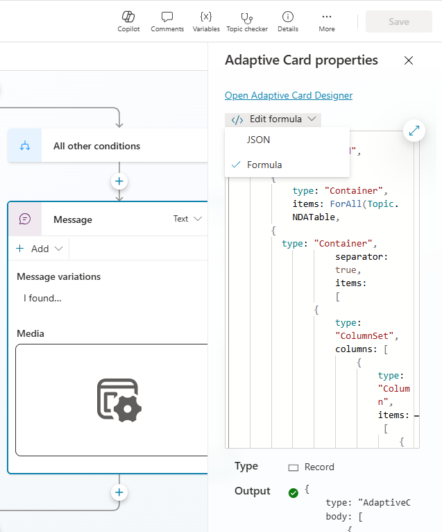
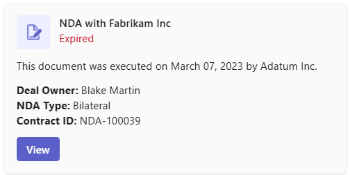
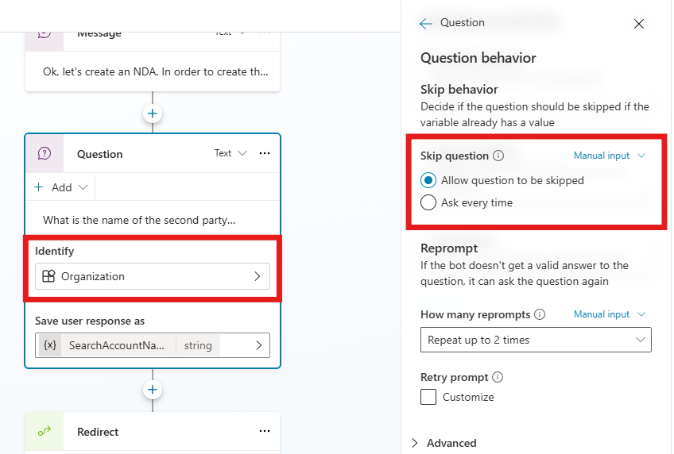
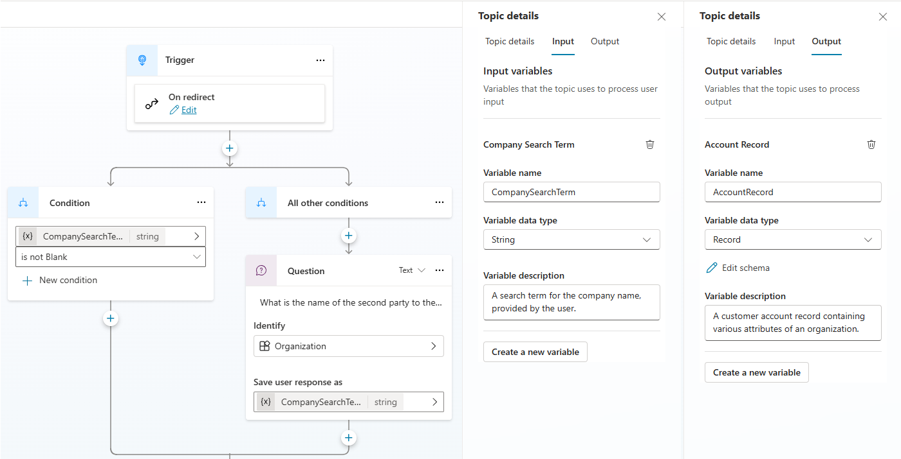
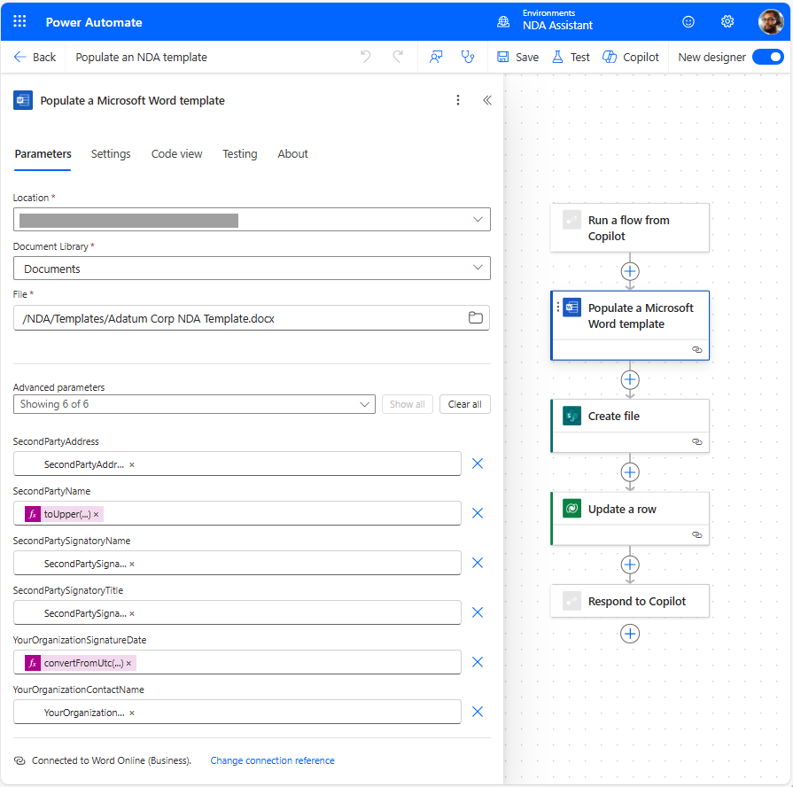
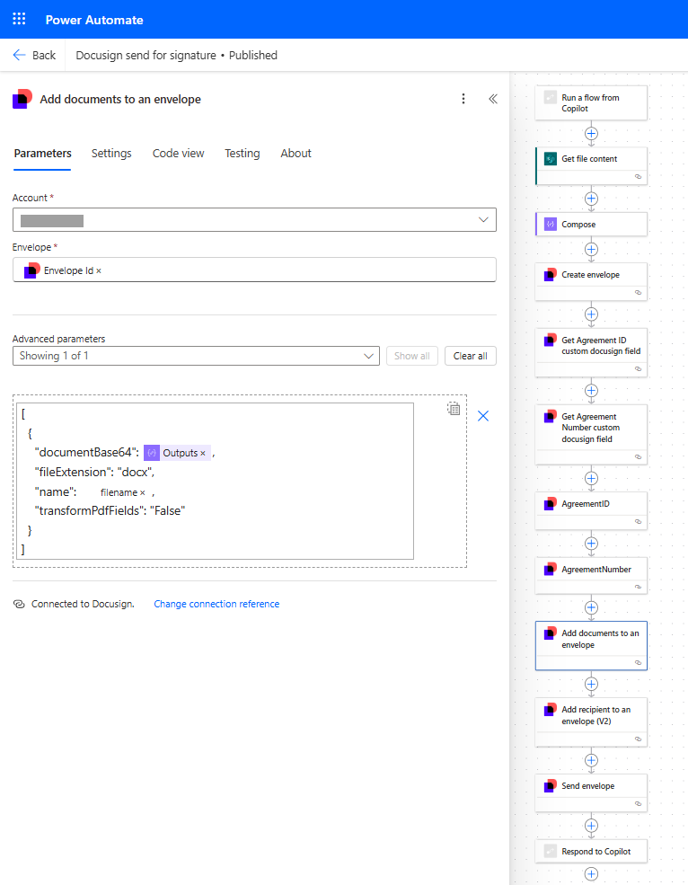
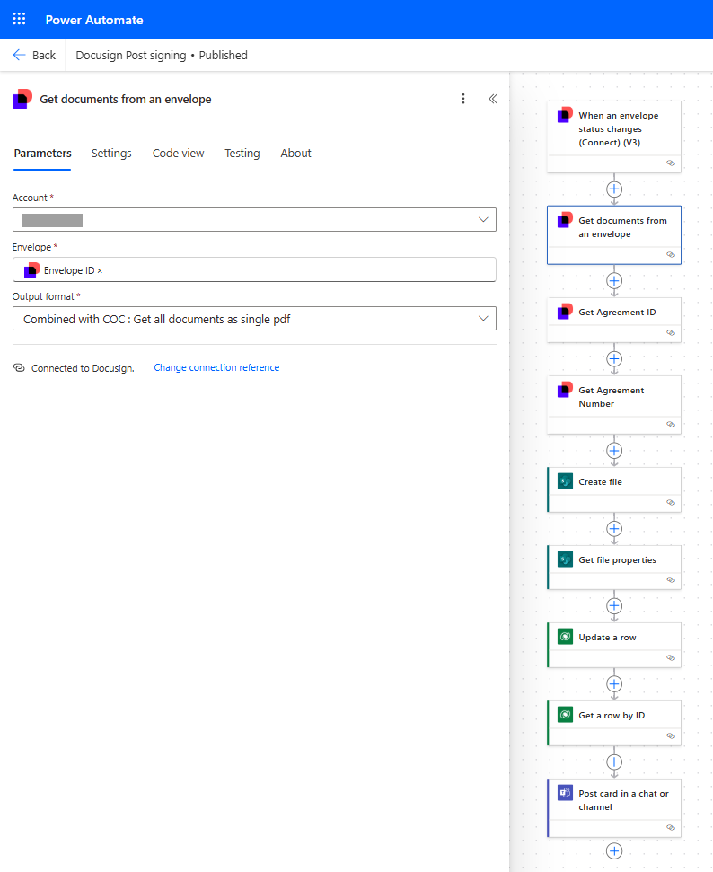

# Differentiators

There are several capabilities that were focused on as key differentiators for this accelerator. Their usage and business value is discussed here.

* [Dynamically-generated Adaptive Cards in Topics](#adaptive_cards)
* [Use of entities and slot filling](#slot_filling)
* [Modular topics with inputs and outputs](#modular_topics)
* [Document manipulation](#document_manipulation)
* [E-signature connector usage](#esignature)

 ``

## Dynamically-generated Adaptive Cards in Topics and Actions

When building agents in Copilot Studio, one of the tools available to create compelling experiences for end users is the ability to present Adaptive Cards.

Adaptive Cards are an open card exchange format enabling developers to exchange UI content in a common and consistent way.  Adaptive Cards are simple JSON objects that describe user interface cards that can include text, images, buttons, and more.

They can readily be created using a drag and drop interface in the [Adaptive Cards Designer](https://adaptivecards.io/designer/).

Once they have been created in the designer (or other tools), then can be presented to users in Topic Messages (by selecting **+Add > Adaptive card** in a Message node), used to gather information from the user (by adding an **Ask with an adaptive card** node to a topic), or displayed as an Action result (by selecting the **Send a message immediately after running this action**, and choosing **You create an adaptive card** option, on the **Outputs** tab of the Action).

The value of Adaptive Cards is enhanced when they are populated with dynamic data that is relevant to the end user or conversation. This is achieved by choosing the **Formula** option for defining the card, and authoring a formula that will return the desired JSON for your card, with variables populated.

This is an example of opting to enter a Power FX formula to define an Adaptive Card to be presented as the result of an Action:

When creating your Power FX formula to produce your Adaptive Card content, you can include variable values that are available in your Action or Topic.

For example, one of the Adaptive Cards that is presented in the accelerator is this one, that displays an existing NDA found for a given account, via a Power Automate flow:

In this instance, a flow named **Find existing NDAs by account id** returns a string of JSON data. That string is then parsed using a Parse JSON node, and turned into an object that contains an array of NDAs. The NDAs are looped through via Power FX formula, with data about each agreement being displayed in the card using **ForAll(Topic.NDATable, { `<display content>` })**.

You can find the full Power FX formula for rendering this Adaptive Card [here](../AdaptiveCards_PowerFXFormulas/AgreementsAdaptiveCard.txt), and you can find all other formulas used in this accelerator in the [AdaptiveCards_PowerFXFormulas](../AdaptiveCards_PowerFXFormulas/) folder.

 ``

## Use of entities and slot filling

Agent conversations are enhanced through natural language processing and understanding, which allow the agent to understand the intent of the user, and take the appropriate action.

The experience for end users is enhanced when agents are able to not only understand intent, but also to identify specific entities within the conversation with the user. An entity can be thought of as a unit of information that represents a certain type of a real-world subject, like a phone number, city, or organization name. With the knowledge granted by entities, an agent can smartly recognize the relevant information from a user input and make use of it.

This accelerator offers two ways for users to engage with the agent:

* by clicking on one of the options in the adaptive card that greets them at the start of the conversation, or;
* by typing in an utterance such as **"create an nda for fabrikam"**

When typing in **"create an nda for fabrikam"**, the agent is able to intelligently identify that "fabrikam" is the name of the organization that you wish to create an NDA for, and is thus able to skip over the step of asking for an organization name.

This is facilitated by having a question node in which the response is identified as an **Organization**, and specifying in the **Question behavior** that we **Allow question to be skipped**

 ``

## Modular topics with inputs and outputs

When designing solutions, whether they be low-code or pro-code, a common best-practice is to use modularity of functionality, to avoid recreating the same experiences in multiple places.

This principle applies when building Copilot Studio agents as well. Capabilities of the agent that may be leveraged in several user paths can ideally be created as smaller, reusable, bite-sized topics that can be called from other topics through redirection from other topics. These topics will typically have input and output variables that allow them to operate in the context of the broader user flow.

An example of this modularity in this accelerator can be seen in the **Find Company** topic.

This topic's purpose is to identify a given company or organization, and is useful for both finding NDAs for a given organization, or creating an NDA for an organization.

As a result, it has been created as a modular topic that is invoked **On redirect**, and has an organization search term as an input variable, and an account record as an output variable:

 ``

## Document manipulation

One of the key value propositions of this accelerator is the ability to auto-generate contracts based on input provided by the user, rather than requiring legal counsel to draft it.

This is facilitated through the retrieval of the relevant content by gathering it through adaptive card inputs provided by the user, then invoking a Power Automate flow to populate a Word template.

The Power Automate flow takes the following steps:

* It is invoked by the agent, with various collected input parameters passed in
* The [Word Online (Business) connector](https://learn.microsoft.com/en-us/connectors/wordonlinebusiness/) is used to populate placeholders within a Word template with dynamic values; See the connector documentation for how you can prepare your Word template with placeholders
* The [SharePoint connector](https://learn.microsoft.com/en-us/connectors/sharepointonline/) is used to create a file in SharePoint with the contents of the populated Word template
* The [Dataverse connector](https://learn.microsoft.com/en-us/connectors/commondataservice/) updates the appropriate agreement record in Dataverse with the document location
* The flow responds to the agent with details of the created document

 

 ``

## E-signature connector usage

In order to expedite the process of obtaining signatures for NDA agreements, e-signature capabilities are leveraged in this accelerator. The accelerator leverages the Docusign connector and e-signature capabilities, but other e-signature provider capabilities may be substituted as desired.

The accelerator uses the Docusign connector in two Power Automate Flows:

* **Docusign send for signature** is invoked by the agent when the user opts to send the agreement for signature
  * the file contents are retrieved from SharePoint
  * a Docusign "envelope" is created, custom fields are populated, to allow the document to be recognized when signature occurs
  * the document and recipients are populated in the envelope
  * the envelope is sent to the recipients for signature

 

* **Docusign Post signing** is invoked when the status of the Docusign envelope changes, which occurs when the document is signed by the recipient
  * the documents and custom fields for agreement identification are retrieved from the envelope
  * a PDF-formatted signed document is created and saved in SharePoint
  * the agreement record status is updated in Dataverse
  * the initiator of the agreement is notified via adaptive card in Teams that signing and execution of the agreement has occurred

 

 By leveraging electronic signature capabilities via easy-to-use Power Platform connectors, time is saved by requestors, signatories, and in-house legal counsel, resulting in increased productivity and enhanced user experiences.
