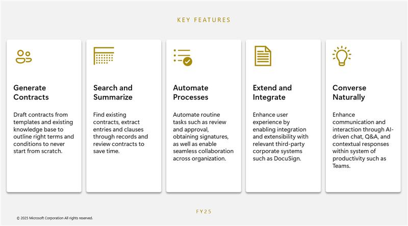

# Contract Assistant

MENU: [**USER STORY**](#user-story) \| [**QUICK DEPLOY**](#quick-deploy) \| [**SUPPORTING DOCUMENTS**](#supporting-documents)

  

# User Story

## Solution Overview

The Contract Assistant copilot agent helps employees quickly create, find, manage and share contracts, saving time and resources by automating contract processing workflows. 

Leveraging Copilot Studio, Power Platform, Microsoft Teams, SharePoint and 3rd party e-signature tools, employees can generate, search and summarize contracts, automate e-sign processes with customers and converse naturally with the agent.

**Note:** This accelerator is not intended to be a production ready solution. The components can be extended through customization and configuration as desired to create a production ready solution. All components packaged have been done through an unmanaged solution, which allows users to be able to customize and extend the components post-deployment.

## Key features

This accelerator focuses on harnessing the following key capabilities:

* [User intent detection in Copilot Studio](https://learn.microsoft.com/en-us/microsoft-copilot-studio/guidance/cux-identify-intents)
* [Adaptive Cards in Copilot Studio](https://learn.microsoft.com/en-us/microsoft-copilot-studio/guidance/adaptive-cards-overview)
* [Publishing Copilot agent in Microsoft Teams](https://learn.microsoft.com/en-us/microsoft-copilot-studio/publication-add-bot-to-microsoft-teams)
* [Capturing e-signatures using DocuSign](https://learn.microsoft.com/en-us/connectors/docusign/)
* [Configure tables in Dataverse](https://learn.microsoft.com/en-us/training/modules/get-started-with-powerapps-common-data-service/)
* [Using SharePoint library for document storage](https://support.microsoft.com/en-us/office/create-a-document-library-in-sharepoint-306728fe-0325-4b28-b60d-f902e1d75939)

Below is a sample landing page of the solution accelerator after it is deployed, set up, and ready to be used:

## Scenario

An employee wants to initiate a request for contract creation (a Non-disclosure Agreement with a customer, or NDA in this example) to allow them to proceed with their sales opportunity with a second party organization. The employee chats with the Contract Assistant agent in Teams, which helps the employee confirm whether or not an NDA contract already exists for the customer. If not, the agent initiates the contract creation by requesting all required information from the employee. Once the information is provided, the agent automatically creates a draft version of the contract and presents it to the employee to confirm if it's ready to be sent to the customer for eSignature. Once the employee reviews the draft and is satisfied, the agent sends the contract to the customer for the eSignature. Once the eSignature process is completed, the signed document is stored in SharePoint, and a Dataverse record is created which stores the status, SharePoint URL, agreement ID and other important details of the NDA Agreement.

By being able to get an executed NDA agreement in place quickly and seamlessly, and without involving in-house legal resources, the employee is able to proceed with their sales opportunity quickly, and the employee's legal department is able to focus on higher-value legal scenarios rather than repetitive tasks.

  

# Quick Deploy

Please click this [**Link to Deployment Guide**](Deployment/README.md) for instructions on how to deploy and set up the solution accelerator.

[**Usage Guidance**](Deployment/Data/USAGE_GUIDANCE.md) has been provided to assist you in executing the steps required to see the included capabilities of this accelerator in action..

## Solution Accelerator Architecture

  

# Supporting Documents

## How to customize

This solution is designed to be easily customizable. All configuration and customizations to this solution will be done in Power Platform and Copilot Studio.

### A note on extension opportunities with Conversation Start Adaptive Card

Note that in the initial Adaptive Card that presents three options (Check if a customer has an NDA; Get information about an NDA; Create a new NDA), the first two options both currently initiate a search for existing NDAs in place for a given organization. As an extension, you may choose to include additional functionality for the second of these options, to provide additional summarization information about the agreement, beyond what is included in the Adaptive Card summary.

### Additional opportunities for extension

There are a variety of opportunities to extend the functionality of this accelerator. Some of these include:

 * Including an in-house legal team eSignature signing step, rather than using a pre-signed template
 * Catering for customer-specific clauses in the agreement
 * Including an internal approval step, potentially using the [Approvals Connector](https://learn.microsoft.com/en-us/connectors/approvals/)
 * Integration with 3rd-party contract management systems
 * Using Generative AI to summarize agreement content, or compare content between a standard vs proposed agreement
 * and more

## Additional resources

1. [Microsoft Power Platform](https://learn.microsoft.com/en-us/power-platform/)
2. [Microsoft Copilot Studio](https://learn.microsoft.com/en-us/microsoft-copilot-studio/)

# Disclaimers

This release only supports English language input and output. Users should not attempt to use the system with any other language or format. The system output may not be compatible with any translation tools or services, and may lose its meaning or coherence if translated.

This release does not reflect the opinions, views, or values of Microsoft Corporation or any of its affiliates, subsidiaries, or partners. The system output is solely based on the system's own logic and algorithms, and does not represent any endorsement, recommendation, or advice from Microsoft or any other entity. Microsoft disclaims any liability or responsibility for any damages, losses, or harms arising from the use of this release or its output by any user or third party.

This release is intended as a proof of concept only, and is not a finished or polished product. It is not intended for commercial use or distribution, and is subject to change or discontinuation without notice. Any planned deployment of this release or its output should include comprehensive testing and evaluation to ensure it is fit for purpose and meets the user's requirements and expectations. Microsoft does not guarantee the quality, performance, reliability, or availability of this release or its output, and does not provide any warranty or support for it.

This Software requires the use of third-party components which are governed by separate proprietary or open-source licenses as identified below, and you must comply with the terms of each applicable license in order to use the Software. You acknowledge and agree that this license does not grant you a license or other right to use any such third-party proprietary or open-source components.

To the extent that the Software includes components or code used in or derived from Microsoft products or services, including without limitation Microsoft Azure Services (collectively, “Microsoft Products and Services”), you must also comply with the Product Terms applicable to such Microsoft Products and Services. You acknowledge and agree that the license governing the Software does not grant you a license or other right to use Microsoft Products and Services. Nothing in the license or this ReadMe file will serve to supersede, amend, terminate or modify any terms in the Product Terms for any Microsoft Products and Services.

You must also comply with all domestic and international export laws and regulations that apply to the Software, which include restrictions on destinations, end users, and end use. For further information on export restrictions, visit [https://aka.ms/exporting](https://aka.ms/exporting).

You acknowledge that the Software and Microsoft Products and Services (1) are not designed, intended or made available as a medical device(s), and (2) are not designed or intended to be a substitute for professional medical advice, diagnosis, treatment, or judgment and should not be used to replace or as a substitute for professional medical advice, diagnosis, treatment, or judgment. Customer is solely responsible for displaying and/or obtaining appropriate consents, warnings, disclaimers, and acknowledgements to end users of Customer’s implementation of the Online Services.

You acknowledge the Software is not subject to SOC 1 and SOC 2 compliance audits. No Microsoft technology, nor any of its component technologies, including the Software, is intended or made available as a substitute for the professional advice, opinion, or judgement of a certified financial services professional. Do not use the Software to replace, substitute, or provide professional financial advice or judgment.

BY ACCESSING OR USING THE SOFTWARE, YOU ACKNOWLEDGE THAT THE SOFTWARE IS NOT DESIGNED OR INTENDED TO SUPPORT ANY USE IN WHICH A SERVICE INTERRUPTION, DEFECT, ERROR, OR OTHER FAILURE OF THE SOFTWARE COULD RESULT IN THE DEATH OR SERIOUS BODILY INJURY OF ANY PERSON OR IN PHYSICAL OR ENVIRONMENTAL DAMAGE (COLLECTIVELY, “HIGH-RISK USE”), AND THAT YOU WILL ENSURE THAT, IN THE EVENT OF ANY INTERRUPTION, DEFECT, ERROR, OR OTHER FAILURE OF THE SOFTWARE, THE SAFETY OF PEOPLE, PROPERTY, AND THE ENVIRONMENT ARE NOT REDUCED BELOW A LEVEL THAT IS REASONABLY, APPROPRIATE, AND LEGAL, WHETHER IN GENERAL OR IN A SPECIFIC INDUSTRY. BY ACCESSING THE SOFTWARE, YOU FURTHER ACKNOWLEDGE THAT YOUR HIGH-RISK USE OF THE SOFTWARE IS AT YOUR OWN RISK.
