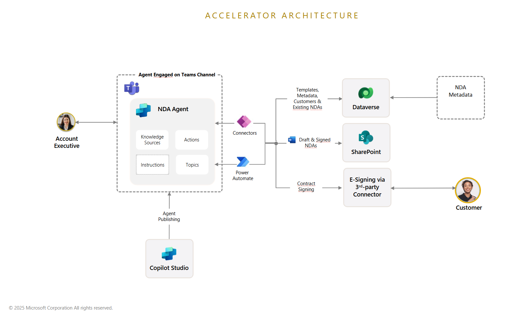
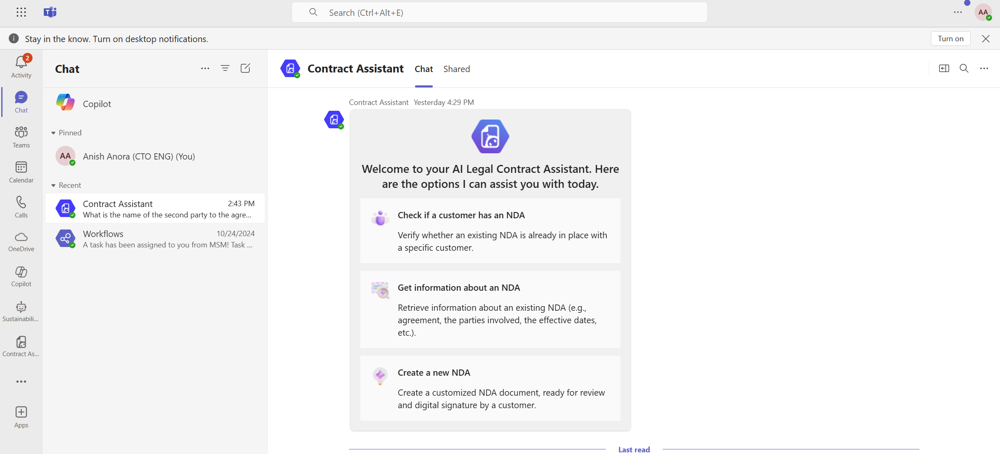

# Agent for Contract Processing

This solution streamlines contract management by creating, finding, managing and sharing contracts which lead to saving time and resources by automating contract processing workflows. The solution leverages Copilot Studio, Dataverse, Power Automate, SharePoint, Microsoft Teams and a 3rd party e-signature connector.

 

  
[**SOLUTION OVERVIEW**](#solution-overview)  \| [**QUICK DEPLOY**](#quick-deploy)  \| [**BUSINESS USE CASE**](#business-use-case)  \| [**SUPPORTING DOCUMENTATION**](#supporting-documentation)

 

<h2>
Solution overview
</h2>

The Agent for Contract Processing helps employees quickly create, find, manage and share contracts, saving time and resources by automating contract processing workflows. 

Leveraging Copilot Studio, Power Platform, Microsoft Teams, SharePoint and 3rd party e-signature tools, employees can generate, search and summarize contracts, automate e-sign processes with customers and converse naturally with the agent.

**Note:** This accelerator is not intended to be a production ready solution. The components can be extended through customization and configuration as desired to create a production ready solution. All components packaged have been done through an unmanaged solution, which allows users to be able to customize and extend the components post-deployment.

### Solution architecture

### How to customize
This solution is designed to be easily customizable. All configuration and customizations to this solution will be done in Power Platform and Copilot Studio.

**A note on extension opportunities with Conversation Start Adaptive Card**

Note that in the initial Adaptive Card that presents three options (Check if a customer has an NDA; Get information about an NDA; Create a new NDA), the first two options both currently initiate a search for existing NDAs in place for a given organization. As an extension, you may choose to include additional functionality for the second of these options, to provide additional summarization information about the agreement, beyond what is included in the Adaptive Card summary.

**Additional opportunities for extension**

There are a variety of opportunities to extend the functionality of this accelerator. Some of these include:

 * Including an in-house legal team eSignature signing step, rather than using a pre-signed template
 * Catering for customer-specific clauses in the agreement
 * Including an internal approval step, potentially using the [Approvals Connector](https://learn.microsoft.com/en-us/connectors/approvals/)
 * Integration with 3rd-party contract management systems
 * Using Generative AI to summarize agreement content, or compare content between a standard vs proposed agreement
 * and more

### Additional resources

This accelerator focuses on harnessing the following key capabilities:

* [User intent detection in Copilot Studio](https://learn.microsoft.com/en-us/microsoft-copilot-studio/guidance/cux-identify-intents)
* [Adaptive Cards in Copilot Studio](https://learn.microsoft.com/en-us/microsoft-copilot-studio/guidance/adaptive-cards-overview)
* [Publishing Copilot agent in Microsoft Teams](https://learn.microsoft.com/en-us/microsoft-copilot-studio/publication-add-bot-to-microsoft-teams)
* [Capturing e-signatures using DocuSign](https://learn.microsoft.com/en-us/connectors/docusign/)
* [Configure tables in Dataverse](https://learn.microsoft.com/en-us/training/modules/get-started-with-powerapps-common-data-service/)
* [Using SharePoint library for document storage](https://support.microsoft.com/en-us/office/create-a-document-library-in-sharepoint-306728fe-0325-4b28-b60d-f902e1d75939)

Additional details on how these capabilities are leveraged in this accelerator can be found here:

* [Dynamically-generated Adaptive Cards in Topics](./Deployment/Differentiators/DIFFERENTIATORS.md#adaptive_cards)
* [Use of entities and slot filling](./Deployment/Differentiators/DIFFERENTIATORS.md#slot_filling)
* [Modular topics with inputs and outputs](./Deployment/Differentiators/DIFFERENTIATORS.md#modular_topics)
* [Document manipulation](./Deployment/Differentiators/DIFFERENTIATORS.md#document_manipulation)
* [E-signature connector usage](./Deployment/Differentiators/DIFFERENTIATORS.md#esignature)

 

### Key features

  
Click to learn more about the key features this solution enables

  - **Generate contracts**  
  Draft contracts from templates and existing knowledge base to outline right terms and conditions to never start from scratch.​
  
  - **Search and summarize**  
  Find existing contracts, extract entries and clauses through records and review contracts to save time.

  - **Automate processes**  
  Automate routine tasks such as review and approval, obtaining signatures, as well as enable seamless collaboration across organization.

  - **Extend and integrate**  
  Enhance user experience by enabling integration and extensibility with relevant third-party corporate systems such as DocuSign.​

  - **Converse naturally**  
  Enhance communication and interaction through AI-driven chat, Q&A, and contextual responses within system of productivity such as Teams.
       

  
<h2>
Quick deploy
</h2>

### How to install or deploy
Please click this [**Link to Deployment Guide**](Deployment/README.md) for instructions on how to deploy and set up the solution accelerator.

[**Usage Guidance**](Deployment/Data/USAGE_GUIDANCE.md) has been provided to assist you in executing the steps required to see the included capabilities of this accelerator in action..

 

### Prerequisites and Costs

To deploy this solution accelerator, ensure you have access to the following

- [Microsoft Power Platform license](https://learn.microsoft.com/en-us/power-platform/admin/pricing-billing-skus) with Dataverse enabled and System Administrator access.
- [Copilot Studio license](https://learn.microsoft.com/en-us/microsoft-copilot-studio/billing-licensing).
- End users having Dataverse access.
- [Docusign license](https://ecom.docusign.com/plans-and-pricing/esignature).
- Access to create a SharePoint site through appropriate [Microsoft 365 license](https://www.microsoft.com/en-us/Licensing/product-licensing/microsoft-365) .

 

| Product | Description | Cost |
|---|---|---|
| [Microsoft Power platform](https://learn.microsoft.com/en-us/power-platform/) | Decription of how the product is used | [Pricing](https://www.microsoft.com/en-us/power-platform/pricing/) |
| [Microsoft copilot studio](https://learn.microsoft.com/en-us/microsoft-copilot-studio/) | Microsoft Copilot Studio is a graphical, low-code tool designed for building AI-driven agents and agent flows. | [Pricing](https://learn.microsoft.com/en-us/microsoft-copilot-studio/billing-licensing) |
| [Docusign](https://www.docusign.com/products/electronic-signature) | DocuSign eSignature is a leading electronic signature solution that allows users to sign documents securely and efficiently from virtually any device. | [Pricing](https://ecom.docusign.com/plans-and-pricing/esignature) |
| [Microsoft 365](https://www.microsoft.com/en-us/microsoft-365/products-apps-services) | Microsoft 365 is a cloud-powered productivity platform that includes a suite of applications and services designed to enhance productivity and collaboration. | [Pricing](https://www.microsoft.com/en-us/microsoft-365/buy/compare-all-microsoft-365-products) |

 

  
<h2>
Business Use Case
</h2>

Below is a sample landing page of the solution accelerator after it is deployed, set up, and ready to be used:

An employee wants to initiate a request for contract creation (a Non-disclosure Agreement with a customer, or NDA in this example) to allow them to proceed with their sales opportunity with a second party organization. The employee chats with the Agent for Contract Processing in Teams, which helps the employee confirm whether or not an NDA contract already exists for the customer. If not, the agent initiates the contract creation by requesting all required information from the employee. Once the information is provided, the agent automatically creates a draft version of the contract and presents it to the employee to confirm if it's ready to be sent to the customer for eSignature. Once the employee reviews the draft and is satisfied, the agent sends the contract to the customer for the eSignature. Once the eSignature process is completed, the signed document is stored in SharePoint, and a Dataverse record is created which stores the status, SharePoint URL, agreement ID and other important details of the NDA Agreement.

By being able to get an executed NDA agreement in place quickly and seamlessly, and without involving in-house legal resources, the employee is able to proceed with their sales opportunity quickly, and the employee's legal department is able to focus on higher-value legal scenarios rather than repetitive tasks.

### Business value

  
Click to learn more about what value this solution provides

  - **​Increased efficiency and time savings**  
  Reduced time spent on manual legal tasks, allowing teams to focus on high-value work. Faster contract processing and compliance checks lead to improved productivity across legal operations.

  - **Faster content analysis**  
  AI-powered tools automate contract search and review, reducing delays and improving oversight helping legal teams make faster, data-driven decisions with improved contract visibility.

  - **Optimized contract management**  
  Integrated systems connect legal tools with contract management platforms to eliminate workflow bottlenecks, reduce administrative workload, and accelerate approvals.

  - **Improved collaboration**  
  Effective coordination between legal teams, business stakeholders, and external counsel ensures smoother contract creation, edits, and approvals, improving overall legal outcomes.
     

  

<h2>
Supporting documentation
</h2>

1. [Microsoft Power Platform](https://learn.microsoft.com/en-us/power-platform/)
2. [Microsoft Copilot Studio](https://learn.microsoft.com/en-us/microsoft-copilot-studio/)

### Security guidelines

You may want to ensure that you configure any Copilot Studio actions, and any Connections used in Power automate flows, to use the authentication that is appropriate for your organization and scenario.

Depending on your desired security model, you may wish to select user authentication for actions rather than agent author authentication. For power automate flows, you may wish to configure connections to use the credentials of run-only users, or with a specific connection that you create.

Please note that this solution leverages a custom Dataverse table called 'NDA Agreements' which stores metadata related to the generated NDA document. Creation of a security role to manage Account, Contact and NDA agreement table access for end users is recommended based on organizational best practices and needs.

Also note that this solution leverages a SharePoint site and document library for the storage of unsigned, signed, and template NDA Agreements. Ensure that the security settings for your site and library are managed in accordance with your organizational best practices and needs. See [Managing SharePoint Online Security](https://learn.microsoft.com/en-us/microsoft-365/community/sharepoint-security-a-team-effort) for more details.

See these resources for more details on setting up authentication:

* [Configure user authentication for actions](https://learn.microsoft.com/en-us/microsoft-copilot-studio/configure-enduser-authentication)
* [Manage owners and users in your flows with Power automate](https://learn.microsoft.com/en-us/sharepoint/dev/business-apps/power-automate/guidance/manage-list-flows)
* [Managing SharePoint Online Security](https://learn.microsoft.com/en-us/microsoft-365/community/sharepoint-security-a-team-effort)

 

### Frequently asked questions

[Click here](./FAQs.md) to learn more about common questions about this solution.

 

### Cross references
Check out similar solution accelerators
 
| Solution Accelerator | Description |
|---|---|
| [Agent for HR services](https://github.com/microsoft/agent-for-hr-service-solution-accelerator) | This solution streamlines HR service workflows with an AI-powered assistant that delivers instant answers, automates record updates, and provides intelligent support, saving time and elevating the employee experience. |
| [Agent for RFP response](https://github.com/microsoft/Conversation-Knowledge-Mining-Solution-Accelerator) | The Agent for RFP response processes RFP documents and leverages its knowledge base to create a draft proposal posted autonomously in Microsoft Teams. |

    

## Provide feedback

Have questions, find a bug, or want to request a feature? [Submit a new issue](https://github.com/microsoft/Agent-for-Contract-Processing-Solution-Accelerator/issues/new/choose) on this repo and we'll connect.

 

## Responsible AI Transparency FAQ
Please refer to [Transparency FAQ](./TRANSPARENCY_FAQ.md) for responsible AI transparency details of this solution accelerator.

 

# Disclaimers

To the extent that the Software includes components or code used in or derived from Microsoft products or services, including without limitation Microsoft Azure Services (collectively, “Microsoft Products and Services”), you must also comply with the Product Terms applicable to such Microsoft Products and Services. You acknowledge and agree that the license governing the Software does not grant you a license or other right to use Microsoft Products and Services. Nothing in the license or this ReadMe file will serve to supersede, amend, terminate or modify any terms in the Product Terms for any Microsoft Products and Services. 

You must also comply with all domestic and international export laws and regulations that apply to the Software, which include restrictions on destinations, end users, and end use. For further information on export restrictions, visit https://aka.ms/exporting. 

You acknowledge that the Software and Microsoft Products and Services (1) are not designed, intended or made available as a medical device(s), and (2) are not designed or intended to be a substitute for professional medical advice, diagnosis, treatment, or judgment and should not be used to replace or as a substitute for professional medical advice, diagnosis, treatment, or judgment. Customer is solely responsible for displaying and/or obtaining appropriate consents, warnings, disclaimers, and acknowledgements to end users of Customer’s implementation of the Online Services. 

You acknowledge the Software is not subject to SOC 1 and SOC 2 compliance audits. No Microsoft technology, nor any of its component technologies, including the Software, is intended or made available as a substitute for the professional advice, opinion, or judgement of a certified financial services professional. Do not use the Software to replace, substitute, or provide professional financial advice or judgment.  

BY ACCESSING OR USING THE SOFTWARE, YOU ACKNOWLEDGE THAT THE SOFTWARE IS NOT DESIGNED OR INTENDED TO SUPPORT ANY USE IN WHICH A SERVICE INTERRUPTION, DEFECT, ERROR, OR OTHER FAILURE OF THE SOFTWARE COULD RESULT IN THE DEATH OR SERIOUS BODILY INJURY OF ANY PERSON OR IN PHYSICAL OR ENVIRONMENTAL DAMAGE (COLLECTIVELY, “HIGH-RISK USE”), AND THAT YOU WILL ENSURE THAT, IN THE EVENT OF ANY INTERRUPTION, DEFECT, ERROR, OR OTHER FAILURE OF THE SOFTWARE, THE SAFETY OF PEOPLE, PROPERTY, AND THE ENVIRONMENT ARE NOT REDUCED BELOW A LEVEL THAT IS REASONABLY, APPROPRIATE, AND LEGAL, WHETHER IN GENERAL OR IN A SPECIFIC INDUSTRY. BY ACCESSING THE SOFTWARE, YOU FURTHER ACKNOWLEDGE THAT YOUR HIGH-RISK USE OF THE SOFTWARE IS AT YOUR OWN RISK.